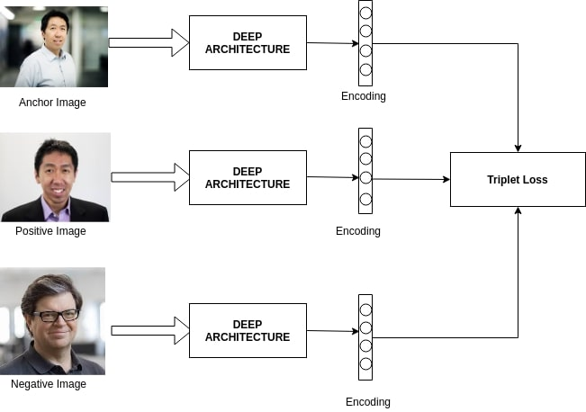

# FaceMatching
Face matching using deep learning (CNN embedding + triplet loss)

## Download Code
clone the repository:
```bash
git clone https://github.com/dali92002/FaceMatching
cd FaceMatching
```
## Requirements
- install requirements.txt

## Prepare your Data

- Download the data from: http://vis-www.cs.umass.edu/lfw/lfw.tgz
- split your data into train and test and put it this way under the same project folder.


```bash
/lfw-deepfunneled
    ├── train
    └── test
```

## Designed Model

The model was designed to embedd the images into a vector of 128 D and train it to make the images of the same person as close as possible and the images of different persons as far as possible using the triplet loss.
This is similar to the [FaceNet](https://arxiv.org/pdf/1503.03832.pdf) paper. You can check it in the file model/FaceMatch.py ..



## Train

To train the model, use the following command 
 
```bash
python main.py --batch_size 16 --path_train_set ./lfw-deepfunneled/train --path_test_set ./lfw-deepfunneled/test
```

Here I specified the batch_size to be 16 and I specified the paths for my training and testing data.


## Test

After training, you can test the model on a pair of images (to decide whether they belong to the same person or no) you can use the folowing comand. You should simply specify the paths of the images to compare.

 
```bash
python test.py --path_img1 ./test/Anne_McLellan/Anne_McLellan_0001.jpg --path_img2 ./lfw-deepfunneled/test/Anne_McLellan/Anne_McLellan_0002.jpg
```

in testing we use the model to get the embeddings of the images (each images is mapped to a vector), then  we compute an euclidian distance between the two vectors and decide basing on this distance of they are from the same person or no. I used a threshold of 1.1 (same as facenet) to make the decision of same/different.

## Some Results

<table style="padding:10px">
    <tr>
        <td style="text-align:center">
            Image 1 
        </td>
        <td style="text-align:center">
            Image 2 
        </td>
        <td style="text-align:center">
            Decision 
        </td>
        <td style="text-align:center">
            Distance
        </td>
    </tr>
    <tr>
        <td style="text-align:center"> 
            
        </td>
        <td style="text-align:center"> 
            
        </td>
        <td style="text-align:center">
            Same 
        </td>
        <td style="text-align:center">
            0.66 
        </td>
    </tr>
    <tr>
        <td style="text-align:center"> 
            
        </td>
        <td style="text-align:center"> 
            
        </td>
        <td style="text-align:center">
            Different 
        </td>
        <td style="text-align:center">
            2.81 
        </td>
    </tr>

</table>


## Authors
- [Mohamed Ali Souibgui](https://github.com/dali92002)